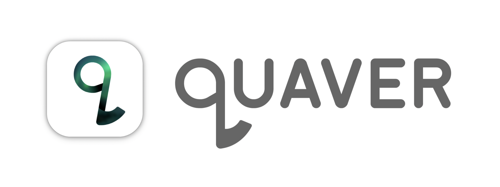
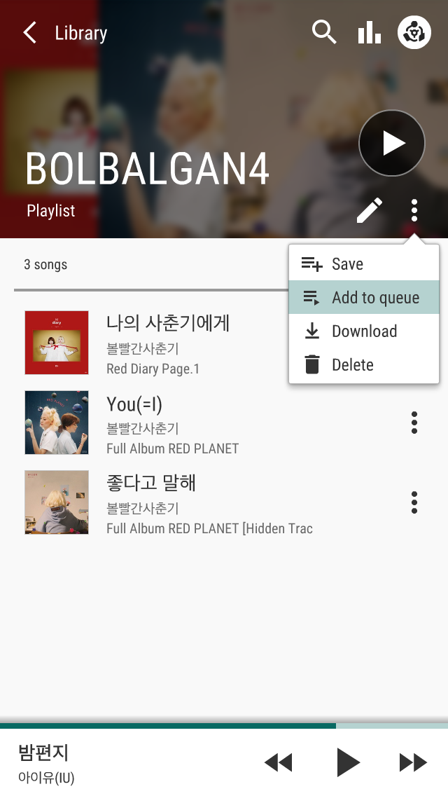
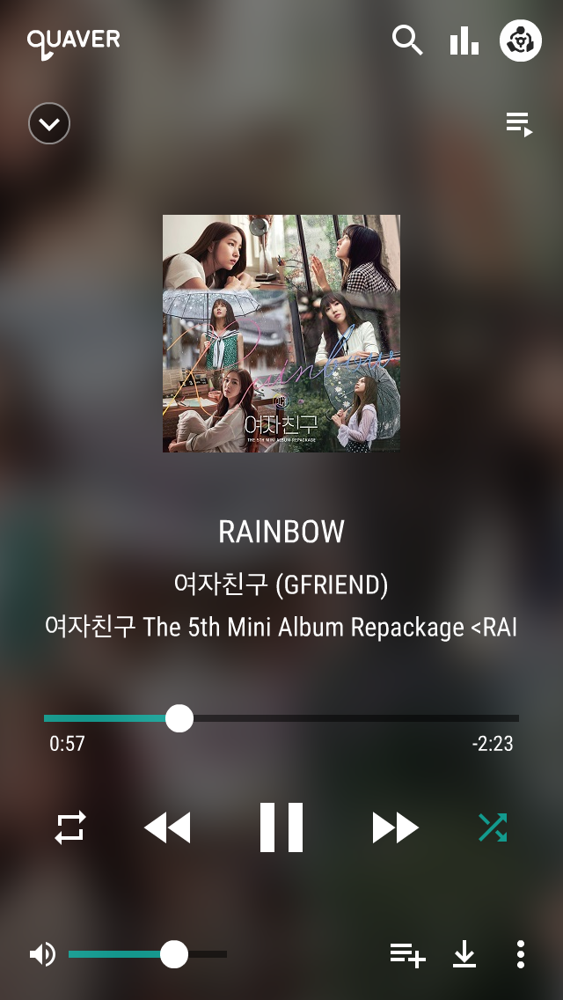
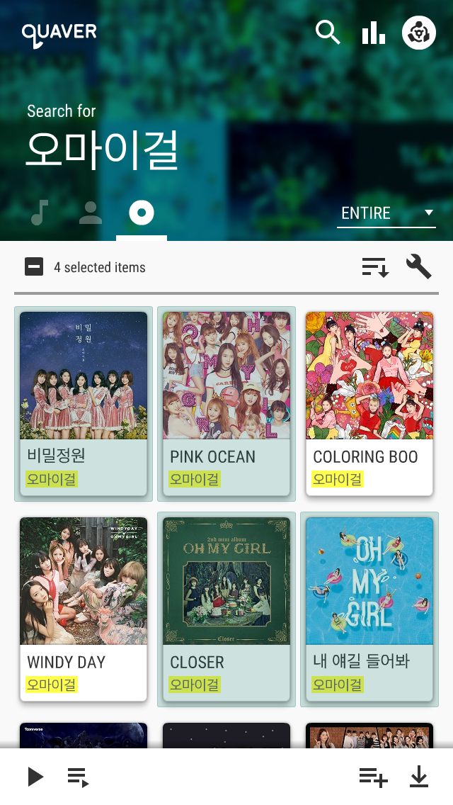

# quaver-ui

**[▶ Demo video](https://youtu.be/v-tqxYfPyF0)**

A UI/UX prototype for a cloud music player integrating with Korean streaming
services, designed following Google's Material Design
guidelines.

**[Prototype](https://quaver-ui.netlify.app/)** (Press Enter to start)

## Screenshots

## Notes

- Designed around the iPhone 5/5s/SE (1st gen) resolution — in hindsight, it probably
  reads better at something larger.
- Scoping the feature set, the approachability, and the layout took far
  longer than expected. Even the logo — getting "eighth note" across
  intuitively — was its own small fight.

## About

- **Timeline:** 2018-02-01 – 2018-05-31
- **Environment:** Adobe Flash CS6, ActionScript 2
- **Language:** Korean

---
[github.com/canplane/quaver-ui](https://github.com/canplane/quaver-ui)
